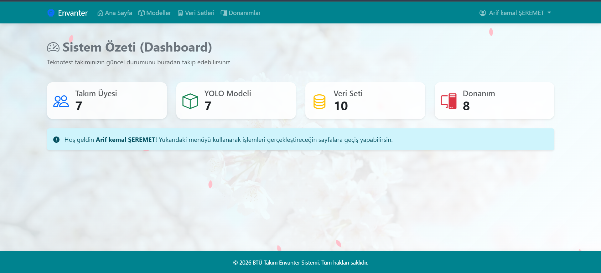
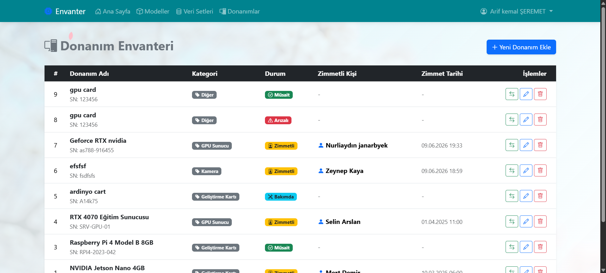
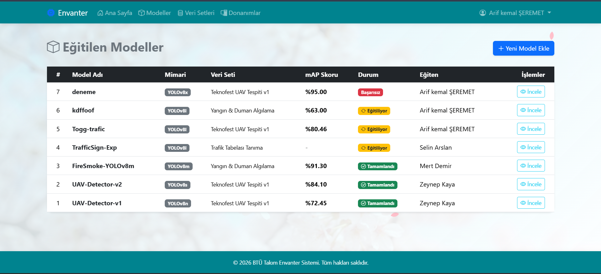
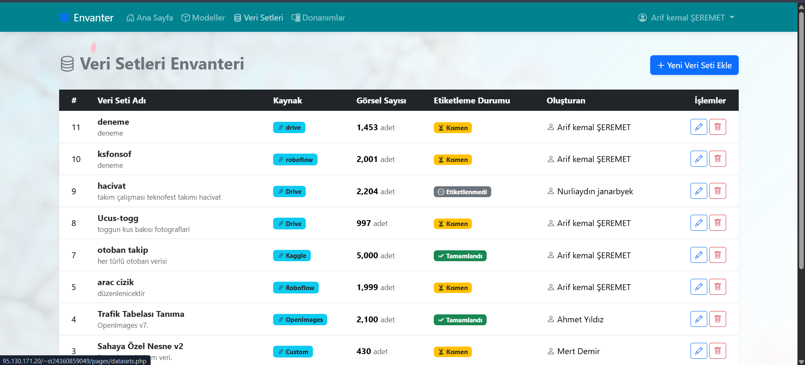

# ⚡ TakımPanel — Teknofest Takım Envanter & AI Model Yönetim Sistemi

<div align="center">


**Teknofest yarışmacıları için donanım, yapay zeka modeli ve veri seti envanterini tek panelden yönetme platformu.**

[🎬 Demo Videosu](#-demo) · [📸 Ekran Görüntüleri](#-ekran-görüntüleri) · [🚀 Kurulum](#-kurulum) · [📂 Mimari](#-proje-mimarisi)

> Geliştirici: **Arif Kemal Şeremet** — arifkemalseremet@gmail.com


</div>

---

## 🎯 Projenin Doğuş Hikayesi — Neden Bu Proje?

> *"İyi bir araç, kötü bir koşucu yapmaz; ama iyi bir koşucu kötü araçla bile sonuca ulaşır. Biz hem iyi araçlar hem de iyi bir sistem istedik."*

Takımımız **Teknofest** kapsamında son derece iddialı bir proje geliştiriyor:

🚗 **TOGG** araçlarının görüntülerini işleyerek sürücü davranışlarını analiz etmek  
📡 **Node5 5G / QoD (Quality on Demand)** mimarisi üzerinden gerçek zamanlı veri akışı  
🤖 **YOLOv8** nesne tespiti modelleriyle anlık sınıflandırma  

Bu kadar yoğun bir teknik süreçte takımın envanteri inanılmaz bir hız ve karmaşayla büyüdü:

| Sorun | Detay |
|-------|-------|
| 🖥️ Donanım kaotik | RTX 3050 Laptop GPU'lar, Jetson Nano'lar, endüstriyel kameralar — **kimde ne var, hiçbir fikir yok** |
| 📦 Model sürümleri kayboldu | YOLOv8n, YOLOv8s, YOLOv8m... Hangi epoch'ta ne mAP skoru çıktı? **Unutuldu gitti** |
| 🗂️ Veri seti linkleri dağıldı | Roboflow projeleri, Kaggle datasetleri... **Herkesin farklı bir linki var** |

**TakımPanel**, tam bu kaosa çözüm olarak doğdu. Hafif, güvenli, şık ve kurulumu 5 dakika.

---

## ✨ Özellikler

### 🔐 Kimlik & Yetkilendirme
- Güvenli **kullanıcı kaydı** ve **oturum açma/kapama**
- `password_hash()` + `password_verify()` ile şifreli saklama (plain-text asla yok)
- PHP **Session** tabanlı oturum yönetimi (düz çerez yok)
- **Admin / Üye** rol sistemi — Kaptan silmek ister, üye sadece eklemek

### 📊 Dashboard (Ana Panel)
- Sistemdeki toplam model, veri seti ve donanım sayılarını anlık gösteren **Glassmorphism** özet kartlar
- MySQL `COUNT()` sorguları ile dinamik veri

### 🛠️ Donanım Yönetimi (CRUD)
- Donanım **ekleme, listeleme, güncelleme ve silme**
- **Zimmetleme sistemi:** Hangi donanım kimdeydi, hangi tarihte alındı — Türkiye saatiyle `DATETIME` kaydı
- Anlık durum takibi: `Boşta` 🟢 / `Kullanımda` 🔵 / `Arızalı` 🔴
- Silmek yerine durumu `Arızalı` güncelleme senaryosu

### 🤖 AI Model Takibi (CRUD)
- Model adı, mimari tipi (YOLOv8n/s/m/l/x), epoch sayısı
- **mAP@0.5 skoru** ve doğruluk oranı kaydı
- Modeli hangi veri setiyle eğittiğini Foreign Key ile bağlama

### 📂 Veri Seti Yönetimi (CRUD)
- Kaynak platform (Roboflow / Kaggle / Custom)
- Görsel sayısı ve etiketleme durumu (`Tamamlandı` / `Devam Ediyor`)
- Kaynak link ile doğrudan erişim

---

## 🎨 Tasarım Felsefesi

Proje arayüzü "sıradan bir ödev projesi" görünümünden kasıtlı olarak uzaklaştırıldı:

| Öğe | Detay |
|-----|-------|
| 🎨 Renk Paleti | Turkuaz & Koyu lacivert dominant, amber vurgu renkleri |
| 🪟 UI Kartlar | **Glassmorphism** — yarı şeffaf cam efekti, `backdrop-filter: blur()` |
| 🌸 Arka Plan | CSS `@keyframes` ile uçuşan **Sakura yaprakları** animasyonu |
| 📐 Bileşenler | Tüm öğeler Bootstrap 5.3 ile stillendirildi |
| 📱 Duyarlı Tasarım | Mobil, tablet ve masaüstü uyumlu responsive layout |

---

## 🗄️ Veritabanı Şeması

```
users ──┬──< models
        ├──< datasets
        └──< hardware (ekleyen)
             hardware (kullanan) >──── users
```

<details>
<summary>📋 Tablo detaylarını görmek için tıkla</summary>

### `users` — Kullanıcılar
| Sütun | Tip | Açıklama |
|-------|-----|----------|
| id | INT PK | Otomatik artan ID |
| ad_soyad | VARCHAR(100) | Tam adı |
| email | VARCHAR(150) UNIQUE | Giriş e-postası |
| sifre_hash | VARCHAR(255) | `password_hash()` ile hash'lenmiş şifre |
| rol | ENUM | `admin` veya `uye` |
| kayit_tarihi | DATETIME | Kayıt zamanı |

### `models` — AI Modelleri
| Sütun | Tip | Açıklama |
|-------|-----|----------|
| id | INT PK | — |
| model_adi | VARCHAR(150) | Modelin adı |
| mimari_tipi | ENUM | YOLOv8n / YOLOv8s / YOLOv8m / YOLOv8l / YOLOv8x / Diğer |
| epoch_sayisi | INT | Eğitim epoch sayısı |
| map_skoru | DECIMAL(5,2) | mAP@0.5 değeri |
| dogruluk_orani | DECIMAL(5,2) | Doğruluk % |
| dataset_id | INT FK | Kullanılan veri seti |
| egiten_id | INT FK | Modeli eğiten kullanıcı |

### `datasets` — Veri Setleri
| Sütun | Tip | Açıklama |
|-------|-----|----------|
| id | INT PK | — |
| isim | VARCHAR(150) | Veri setinin adı |
| kaynak | ENUM | Roboflow / Kaggle / Custom |
| gorsel_sayisi | INT | Toplam görsel adedi |
| etiketleme_durumu | ENUM | Tamamlandı / Devam Ediyor |
| kaynak_link | VARCHAR(500) | Platforma link |

### `hardware` — Donanım Envanteri
| Sütun | Tip | Açıklama |
|-------|-----|----------|
| id | INT PK | — |
| donanim_adi | VARCHAR(150) | Cihaz adı |
| kategori | ENUM | Kamera / Geliştirme Kartı / Sensör / Bilgisayar / Diğer |
| durum | ENUM | Boşta / Kullanımda / Arızalı |
| kullanan_id | INT FK NULL | Zimmetlenen kullanıcı (boşsa NULL) |
| teslim_tarihi | DATE | Zimmet tarihi |

</details>

---

## 📂 Proje Mimarisi

<details>
<summary>🗂️ Dosya yapısını görmek için tıkla</summary>

```
proje/
├── 📁 config/
│   └── db.php                  ← PDO bağlantısı (hosting'e alırken güncelle)
│
├── 📁 includes/
│   ├── header.php              ← Bootstrap navbar, CDN linkleri
│   ├── footer.php              ← Kapanış etiketleri, Bootstrap JS
│   └── auth.php               ← Session fonksiyonları (requireLogin, isAdmin...)
│
├── 📁 pages/
│   ├── dashboard.php           ← İstatistik paneli
│   ├── hardware.php            ← Donanım listesi
│   ├── add_hardware.php        ← Donanım ekleme formu
│   ├── edit_hardware.php       ← Donanım düzenleme
│   ├── models.php              ← AI model listesi
│   ├── add_model.php           ← Model ekleme
│   ├── datasets.php            ← Veri seti listesi
│   └── add_dataset.php         ← Veri seti ekleme
│
├── 📁 images/                  ← README ekran görüntüleri
│   ├── dashboard.png
│   ├── hardware.png
│   ├── models.png
│   └── login.png
│
├── index.php                   ← Bekçi — girişe göre yönlendirme
├── login.php                   ← Giriş formu
├── register.php                ← Kayıt formu
├── logout.php                  ← Oturumu kapat
├── database.sql                ← phpMyAdmin'den alınan veritabanı yedeği
├── AI.md                       ← Yapay zeka yardım günlüğü
└── README.md                   ← Bu dosya
```

</details>

---

## 🚀 Kurulum

### Gereksinimler
- PHP 8.0+
- MySQL 8.0+ / MariaDB 10.4+
- Apache / Nginx (veya XAMPP / WAMP lokal ortam)

### Adım Adım Kurulum

**1. Repoyu klonla**
```bash
git clone https://github.com/Arif-kemal/Web-PHP-teknofest-inventory-system.git
cd Web-PHP-teknofest-inventory-system
```

**2. Veritabanını oluştur ve içe aktar**

phpMyAdmin veya MySQL CLI kullanarak `database.sql` dosyasını içe aktar:

```bash
# CLI ile:
mysql -u root -p < database.sql

# phpMyAdmin ile:
# Sol panel → Yeni Veritabanı → "teknofest_db" → Oluştur
# Üst menü → İçe Aktar → database.sql dosyasını seç → Git
```

**3. Veritabanı bağlantısını yapılandır**

`config/db.php` dosyasını aç ve bilgileri güncelle:

```php
define('DB_HOST', 'localhost');   // Genellikle değişmez
define('DB_NAME', 'teknofest_db');
define('DB_USER', 'root');        // ← Kendi kullanıcı adın
define('DB_PASS', '');            // ← Kendi şifren
```

> ⚠️ **Hosting'e alırken:** Hosting kontrol panelinden aldığın veritabanı adı, kullanıcı adı ve şifreyi buraya gir. `database.sql` içindeki bağlantı bilgilerini de kontrol et.

**4. Projeyi çalıştır**

```
# XAMPP kullanıyorsan:
# Klasörü htdocs/takimpanel/ içine koy
# Tarayıcıda aç:
http://localhost/takimpanel/

```

**5. Kayıt ol ve giriş yap**

Ana sayfada `register.php` ile hesap oluştur, ardından giriş yap.

---

## 🎬 Demo

▶️ **[https://youtu.be/pTcWY_yyfKk](https://youtu.be/pTcWY_yyfKk)**

---

## 📸 Ekran Görüntüleri

### 🏠 Dashboard


### 🔐 Donanım Envanteri


### 🛠️ Yolvo modelleri


### 🤖 Veri setleri


---

## 🔒 Güvenlik Notları

| Önlem | Uygulama |
|-------|----------|
| Şifre güvenliği | `password_hash()` / `password_verify()` (bcrypt) |
| Oturum yönetimi | PHP `$_SESSION` — düz çerez yok |
| Session fixation | Giriş sonrası `session_regenerate_id(true)` |
| SQL Injection | PDO Prepared Statements — her sorguda parametreli |
| XSS Koruması | Tüm çıktılarda `htmlspecialchars()` |

---

## 🛠️ Kullanılan Teknolojiler

| Katman | Teknoloji |
|--------|-----------|
| Backend | PHP 8+ (Vanilla — framework yok, prosedürel PDO) |
| Veritabanı | MySQL 8 / PDO Prepared Statements |
| Frontend | HTML5, CSS3, Bootstrap 5.3 |
| İkonlar | Bootstrap Icons 1.11 |
| Güvenlik | bcrypt, PHP Sessions, Prepared Statements |

---

## 🌐 Diğer Takımlar İçin Değer Önerisi

Bu projeyi sadece bizim takımımız değil; **otonom araç, görüntü işleme veya IoT** üzerine çalışan tüm ekipler kullanabilir:

- 🏎️ Otonom araç takımları → model ve sensör envanteri
- 🤖 Robotik takımları → geliştirme kartı zimmet takibi
- 🌾 Tarım teknolojisi takımları → drone ve kamera yönetimi
- 🎓 Üniversite yapay zeka kulüpleri → veri seti ve model kütüphanesi

Repoyu **fork'la**, `config/db.php` ayarla, `database.sql`'i içe aktar — 5 dakikada kendi sistemin hazır.

---

## 📄 Lisans

MIT License — Dilediğin gibi kullan, fork'la, geliştir.

---

<div align="center">

---

*📚 Bu proje, **Web Tabanlı Programlama** dersi kapsamında dönem projesi olarak geliştirilmiştir.*  
*Proje gereksinimleri doğrultusunda; kullanıcı kaydı, oturum yönetimi, CRUD operasyonları,*  
*hazır CSS kütüphanesi kullanımı ve güvenlik standartları eksiksiz uygulanmıştır.*  
*Backend tarafında herhangi bir harici PHP kütüphanesi/framework kullanılmamış;*  
*tüm kodlar doğrudan **PDO** ile güvenli **Vanilla PHP 8+** olarak özgün biçimde yazılmıştır.*

---

</div>